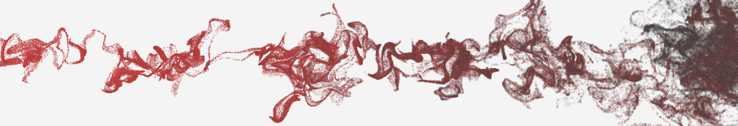
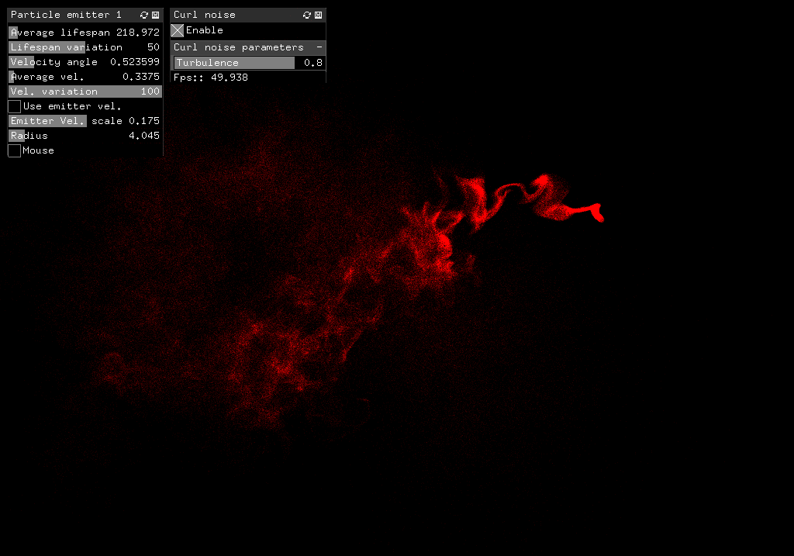
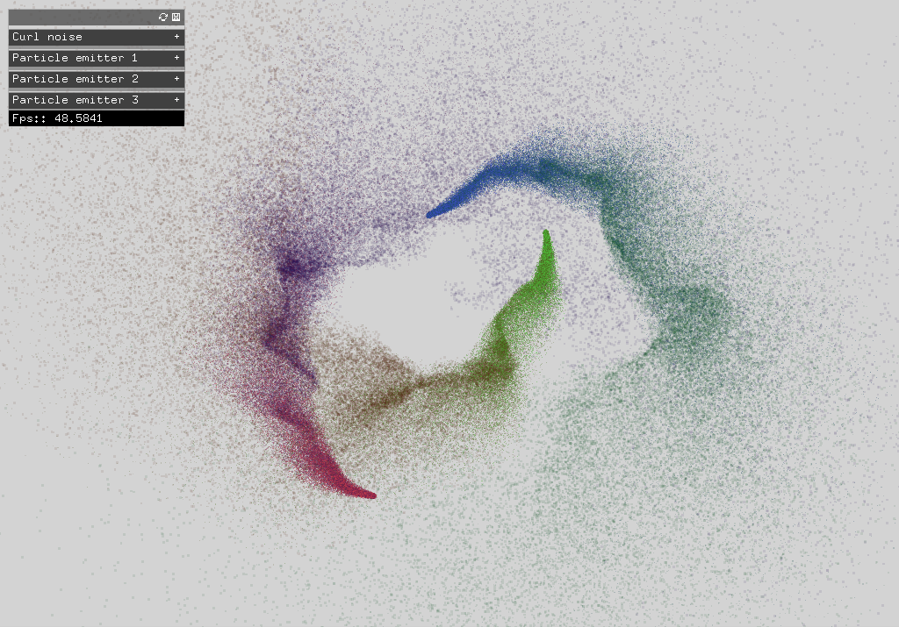

ofxCurlNoise
============

Introduction
------------

**!!! WARNING:** this addon uses oF v0.9.0, that is still in development.

This addon provides a particle system with a curl noise. 

The code for the curl noise comes from [dli/flow](https://github.com/dli/flow).

Demo video: [vimeo.com/120776831](https://vimeo.com/120776831)

Installation
------------

Just copy the `ofxCurlNoise` folder into your `openFrameworks/addons/` folder.

Usage
-----

You first have to set the OpenGL version to 4.3 in the `main.cpp` of your project before using this addon. You can look at one of the examples to see how to do it.

First, you need to create and setup a `ParticleEmitter`.
After this, you can setup the particle system with the number of particles you want. For the moment, it works well only with a number of particles that is a **power of 2**. Here is how your `ofApp::setup()` should look like:

    void ofApp::setup(){
    	emitter.setup();
    	curlNoise.setup(1024*256);
    }

Then you update the position of your particle emitter and the particle system.

    void ofApp::update(){
    	float x = ...;
    	float y = ...;
    	emitter.update(x, y);
    	curlNoise.update();
    }

Finally you draw the particles.

    void ofApp::draw(){
    	curlNoise.draw(;)
    }

You can use multiple particle emitters.

You can set the turbulence coefficient of the curl noise programmatically by calling `ofxCurlNoise::setTurbulence(float t)`.

The parameters of the emitter is accessible via `ParticleEmitter::parameters` (see examples).

Examples
--------

	
	<em>Curl noise example</em>

	
	<em>Curl noise example - Advanced</em>

Dependencies
------------
None for the addon.
ofxGui for the examples.

Compatibility
------------
This addon uses oF v0.9.0 (still in development) and OpenGL v4.3 or higher.
It was tested with linux and oF v0.9.0 (commit bb3572dd48a3d2fa5a8ccb01a0b593d8926ec7b2). 

<!-- TODO 
- Fix ParticleEmitter data.id problem (i.e. if we declare a ParticleEmitter that we don't use -> segfault)

-->

<!--Known issues
-------------->

<!--Version history
-------------->

<!-- It make sense to include a version history here (newest releases first), describing new features and changes to the addon. Use [git tags](http://learn.github.com/p/tagging.html) to mark release points in your repo, too! -->

<!-- 
### Version 0.1 (Date):
Describe relevant changes etc. -->

License
-------
The MIT License (MIT)

Copyright (c) 2014 Elie Génard

Permission is hereby granted, free of charge, to any person obtaining a copy
of this software and associated documentation files (the "Software"), to deal
in the Software without restriction, including without limitation the rights
to use, copy, modify, merge, publish, distribute, sublicense, and/or sell
copies of the Software, and to permit persons to whom the Software is
furnished to do so, subject to the following conditions:

The above copyright notice and this permission notice shall be included in all
copies or substantial portions of the Software.

THE SOFTWARE IS PROVIDED "AS IS", WITHOUT WARRANTY OF ANY KIND, EXPRESS OR
IMPLIED, INCLUDING BUT NOT LIMITED TO THE WARRANTIES OF MERCHANTABILITY,
FITNESS FOR A PARTICULAR PURPOSE AND NONINFRINGEMENT. IN NO EVENT SHALL THE
AUTHORS OR COPYRIGHT HOLDERS BE LIABLE FOR ANY CLAIM, DAMAGES OR OTHER
LIABILITY, WHETHER IN AN ACTION OF CONTRACT, TORT OR OTHERWISE, ARISING FROM,
OUT OF OR IN CONNECTION WITH THE SOFTWARE OR THE USE OR OTHER DEALINGS IN THE
SOFTWARE.